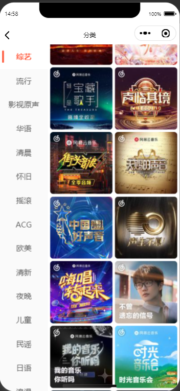
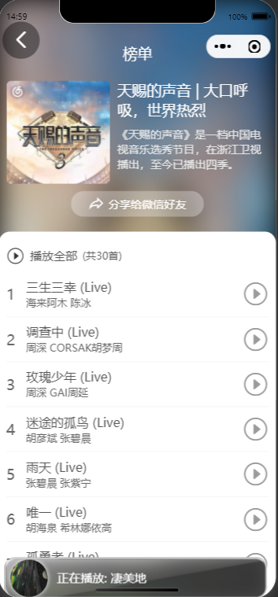
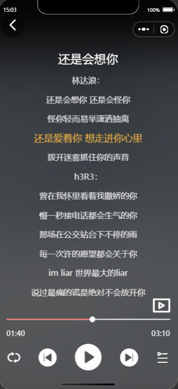

# 本项目后端接口基于GitHub开源项目进行开发的原生在线音乐微信小程序
## 后端接口开源项目地址：https://github.com/Binaryify/NeteaseCloudMusicApi
## 执行方式如下
### 先准备好放置的文件夹,用编辑器(如vscode)打开文件夹再打开终端
>git clone 本项目仓库地址
### 完成后进入切入该项目根路径
>cd OnlineMusicWeChatMiniProgram/
### 安装依赖包
>npm install

## 去到后端开源项目并按照提示clone下来并切换到项目根路径安装依赖
### 完成后在根路径执行如下
>node app.js
### 看到如下提示说明后端执行成功
>server running @ http://localhost:3000

## 此时打开微信开发者工具(下载即可),选择导入,选择OnlineMusicWeChatMiniProgram,然后打开,点击左上角区域的模拟器打开手机模拟
## 点击设置-->项目设置-->勾选不校验合法域名
## 完成后项目即可完整运行

### 项目总体效果如下:

